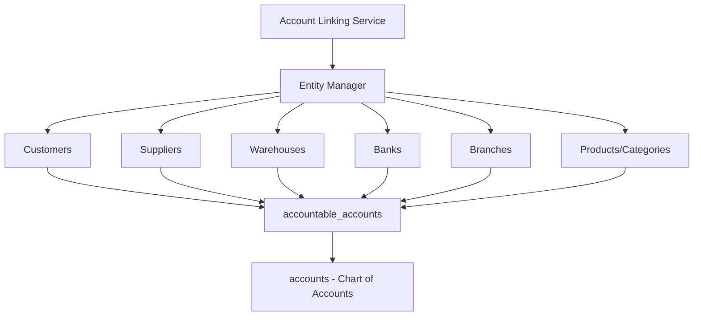

# نظام الربط التلقائي الشامل للحسابات

## Universal Account Linking System

### 1. المخطط العام (System Architecture)



### 2. هيكل البيانات المطلوب

#### A) Migration للجدول المركزي

```php
// 2025_xx_xx_create_accountable_accounts_table.php
Schema::create('accountable_accounts', function (Blueprint $table) {
    $table->id();
    $table->foreignId('account_id')->constrained('accounts')->onDelete('cascade');
    $table->string('accountable_type'); // Customer, Supplier, Warehouse, etc.
    $table->unsignedBigInteger('accountable_id');
    $table->boolean('auto_created')->default(true);
    $table->json('sync_settings')->nullable(); // إعدادات المزامنة
    $table->timestamp('last_sync_at')->nullable();
    $table->timestamps();

    $table->unique(['accountable_type', 'accountable_id']);
    $table->index(['account_id', 'accountable_type']);
});
```

#### B) تعديل الجداول الموجودة

```sql
-- إضافة عمود للجداول الحالية
ALTER TABLE customers ADD COLUMN account_id BIGINT UNSIGNED NULL;
ALTER TABLE suppliers ADD COLUMN account_id BIGINT UNSIGNED NULL;
ALTER TABLE warehouses ADD COLUMN account_id BIGINT UNSIGNED NULL;
ALTER TABLE banks ADD COLUMN account_id BIGINT UNSIGNED NULL;
```

### 3. نظام الكود والأكواد التلقائية

#### A) هيكل أكواد الحسابات

```
Customers:  CUS-001, CUS-002, CUS-003
Suppliers:  SUP-001, SUP-002, SUP-003
Warehouses: WHE-001, WHE-002, WHE-003
Banks:      BNK-001, BNK-002, BNK-003
Branches:   BRN-001, BRN-002, BRN-003
```

#### B) إعدادات الحسابات الأب (Parent Accounts)

```php
'account_parents' => [
    'Customer' => [
        'individual' => 'parent_account_id_for_individual_customers',
        'company' => 'parent_account_id_for_company_customers'
    ],
    'Supplier' => [
        'individual' => 'parent_account_id_for_individual_suppliers',
        'company' => 'parent_account_id_for_company_suppliers'
    ],
    'Warehouse' => 'parent_account_id_for_warehouses',
    'Bank' => 'parent_account_id_for_banks'
]
```

### 4. خدمات النظام المطلوبة

#### A) AccountLinkingService - الخدمة الرئيسية

-   createAccountForEntity() - إنشاء حساب للكيان
-   syncEntityWithAccount() - مزامنة البيانات
-   unlinkEntityFromAccount() - إلغاء الربط
-   getEntityAccount() - الحصول على حساب الكيان
-   bulkCreateAccounts() - إنشاء حسابات متعددة

#### B) EntityAccountManager - مدير الكيانات

-   registerEntityType() - تسجيل نوع كيان جديد
-   getEntityConfig() - الحصول على إعدادات الكيان
-   generateAccountCode() - توليد كود الحساب
-   getParentAccount() - تحديد الحساب الأب

#### C) AccountSyncService - خدمة المزامنة

-   syncBalance() - مزامنة الأرصدة
-   syncBasicInfo() - مزامنة المعلومات الأساسية
-   syncStatus() - مزامنة الحالة (active/inactive)
-   scheduleSync() - جدولة المزامنة التلقائية

### 5. Events والـ Listeners المطلوبة

#### A) Events

```php
EntityCreated::class     // عند إنشاء كيان جديد
EntityUpdated::class     // عند تحديث كيان
EntityDeleted::class     // عند حذف كيان
EntityStatusChanged::class // عند تغيير حالة الكيان
BalanceChanged::class    // عند تغيير الرصيد
```

#### B) Listeners

```php
CreateAccountForEntity::class    // إنشاء حساب تلقائي
SyncAccountWithEntity::class     // مزامنة الحساب
UpdateAccountBalance::class      // تحديث رصيد الحساب
DeactivateEntityAccount::class   // تعطيل حساب الكيان
```

### 6. الواجهات المطلوبة

#### A) واجهة إدارة الربط

-   قائمة بجميع الكيانات المربوطة
-   إمكانية إنشاء حسابات يدوياً
-   إعدادات المزامنة التلقائية
-   تقارير الربط والمزامنة

#### B) تحسينات على الواجهات الحالية

-   عرض رقم الحساب في قوائم الكيانات
-   روابط سريعة للانتقال للحساب
-   مؤشرات حالة الربط والمزامنة
-   أزرار المزامنة اليدوية

### 7. إعدادات النظام المطلوبة

#### A) ملف config/account_linking.php

```php
return [
    'auto_create_accounts' => true,
    'auto_sync_enabled' => true,
    'sync_frequency' => 'real_time', // real_time, hourly, daily

    'entities' => [
        'Customer' => [
            'enabled' => true,
            'parent_accounts' => [
                'individual' => 'customers_individual_account_id',
                'company' => 'customers_company_account_id'
            ],
            'code_prefix' => 'CUS',
            'account_type' => 'assets',
            'account_nature' => 'debit',
            'sync_fields' => ['name', 'balance', 'is_active']
        ],
        // ... باقي الكيانات
    ]
];
```

### 8. مراحل التطبيق

#### المرحلة الأولى - الأساسيات (Week 1)

1. إنشاء migration للجدول المركزي
2. تطوير AccountLinkingService الأساسي
3. تطبيق النظام على العملاء فقط

#### المرحلة الثانية - التوسع (Week 2)

1. إضافة الموردين والمخازن
2. تطوير واجهة إدارة الربط
3. إضافة Events والـ Listeners

#### المرحلة الثالثة - التحسينات (Week 3)

1. إضافة البنوك والفروع
2. تطوير نظام المزامنة المتقدم
3. تحسين الواجهات الحالية

#### المرحلة الرابعة - الاستكمال (Week 4)

1. إضافة التقارير والإحصائيات
2. تطبيق النظام على باقي الكيانات
3. اختبارات شاملة وتحسينات الأداء

### 9. المميزات المتوقعة

#### A) للمستخدم

-   ربط تلقائي بين جميع الكيانات ودليل الحسابات
-   مزامنة فورية للأرصدة والبيانات
-   واجهة موحدة لإدارة الربط
-   تقارير شاملة للحسابات المرتبطة

#### B) للمطور

-   نظام قابل للتوسع لإضافة كيانات جديدة
-   API موحد للتعامل مع الربط
-   Events system مرن للتخصيص
-   إعدادات شاملة لكل كيان

#### C) للنظام

-   أداء محسن عبر الـ eager loading
-   عمليات batch للتحديثات المتعددة
-   logging شامل للعمليات
-   backup تلقائي للبيانات الحساسة

### 10. اعتبارات الأمان والأداء

#### A) الأمان

-   التحقق من صلاحيات الوصول للحسابات
-   تشفير البيانات الحساسة
-   audit log لجميع العمليات

#### B) الأداء

-   indexing محسن للجداول
-   caching للاستعلامات المتكررة
-   queue للعمليات الثقيلة
